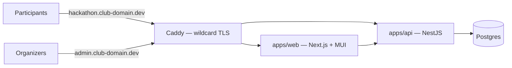

<div align="center">

# event-utils

**One platform. Every club event. One codebase.**

Stop rebuilding a throwaway website for every hackathon, recruitment drive, and workshop.
event-utils runs *all* of a club's events from a single, themeable, open-source platform.

[](LICENSE)
[](docs/architecture.md)
[](#contributing)
[](https://github.com/recursekmit)

[Architecture](docs/architecture.md) · [Local setup](INSTRUCTIONS.md) · [Feature requests](.github/ISSUE_TEMPLATE/feature_request.yml) · [Issues](https://github.com/recursekmit/event-utils/issues)

</div>

---

## Table of contents

- [Why event-utils exists](#why-event-utils-exists)
- [What every event gets](#what-every-event-gets)
- [How it works](#how-it-works)
- [Status & roadmap](#status--roadmap)
- [Repository layout](#repository-layout)
- [Tech stack](#tech-stack)
- [Getting started](#getting-started)
- [Contributing](#contributing)
- [License](#license)

## Why event-utils exists

Clubs run the same *category* of events every year — hackathons, recruitment drives, workshops, fests — and every single time, someone builds a one-off website that gets thrown away. Months of work, zero reuse, and the next batch of juniors starts from scratch.

event-utils is the fix: **one central deployment where every event gets its own subdomain, its own theme, and exactly the features it needs** — assembled from reusable building blocks instead of rebuilt from zero.

## What every event gets

| Without event-utils | With event-utils |
|---|---|
| A new website built (and abandoned) per event | `hackathon.recurse.dev`, live in minutes |
| Whatever styling the last dev felt like | Its own theme — colors, fonts, logo — via design tokens & presets |
| Features rebuilt from scratch each time | Mix-and-match **modules**: registration, judging, exams, check-in… |
| Credentials & data scattered across services | One system with roles: organizers, judges, participants |
| Thrown away after the event | Improved by every event that uses it |

## How it works

One Next.js app serves everything, resolved by host: `<event-slug>.club-domain.dev` renders that event's themed site, `admin.club-domain.dev` is the organizer shell, and the apex domain is the public event index.



Three ideas carry the whole design:

1. **Modules.** Everything beyond the core is a self-contained package declared by a manifest — its routes, permissions, settings, and the events it listens for. Organizers toggle modules per event; a fresh event with zero modules still shows a real landing page.
2. **The hook bus.** Modules never import each other. Integration happens only through typed events like `forms.submitted` or `event.published`, so a notifications module can react to a registration without knowing the forms module exists.
3. **Design tokens.** Themes are stored as named tokens per event, consumed natively by MUI's theming — dynamic per-event branding with no rebuild step.

The full picture — data model, module manifest spec, hook contracts, and the reasoning behind every decision (ADR log) — lives in [**docs/architecture.md**](docs/architecture.md). It's written to be self-contained: paste it into any AI assistant and it has full context.

## Status & roadmap

> **This repo is in the docs phase (v0.1).** The architecture is settled and under CIG review; the code skeleton comes next. Feature-request issues are open *now* — early proposals directly shape the module API before it freezes.

| Phase | Deliverable |
|---|---|
| **0 — now** | Architecture doc, feature-request intake open |
| **1 — skeleton** | Monorepo, magic-link auth, org/event model, module registry stub, theming, Caddy + compose |
| **2 — reference module** | `forms` module: builder, registration flow, submissions admin |
| **3 — freeze** | Module API v1 frozen, `CREATE-MODULE.md` + template finalized, CI gates on |
| **4 — CIG rounds** | Accepted specs built in rounds: judging, exams, check-in… |

## Repository layout

Planned (pnpm workspaces monorepo):

```
event-utils/
├── apps/
│   ├── web/                 # Next.js — event sites + admin shell
│   └── api/                 # NestJS — core API + module registry + hook bus
├── packages/
│   ├── core/                # shared types: manifest spec, hook bus contracts
│   ├── theme/               # token definitions, presets, theme utilities
│   └── ui/                  # shared primitives beyond MUI
├── modules/
│   ├── _template/           # copy-paste starting point for new modules
│   └── forms/               # reference module: forms + registration
├── docs/                    # architecture.md — the source of truth
└── docker-compose.yml       # web, api, postgres, caddy (+ mailhog in dev)
```

## Tech stack

| Layer | Choice |
|---|---|
| Frontend | Next.js (App Router) + MUI |
| Backend | NestJS |
| Database | Postgres + Prisma |
| Auth | Email magic links (self-built) |
| Email | Mailer DI interface → college SMTP, Resend-ready |
| Monorepo | pnpm workspaces |
| Proxy / TLS | Caddy (automatic wildcard TLS) |
| Deployment | Docker Compose on the club VPS |

Why each choice was made: see the ADR log in [docs/architecture.md](docs/architecture.md).

## Getting started

Full setup instructions — prerequisites, install, running the stack, and dev URLs — are in **[INSTRUCTIONS.md](INSTRUCTIONS.md)**.

Until the Phase 1 skeleton lands, the quick version is:

```bash
git clone https://github.com/recursekmit/event-utils.git
cd event-utils
pnpm install
docker compose up        # web + api + postgres + caddy
```

> Heads-up: these commands document the Phase 1 layout — see [INSTRUCTIONS.md](INSTRUCTIONS.md) for the exact current state and progress.

## Contributing

Built by the [Recurse](https://github.com/recursekmit) web-dev CIG (KMIT) — outside contributors very welcome.

The best way to contribute right now is a **feature request**: tell us the real event workflow you're trying to solve for, and we'll turn it into a spec built in an upcoming round. Use the [feature-request template](https://github.com/recursekmit/event-utils/issues/new) — the more context you give (who uses it, what happens step by step, what breaks today), the faster it gets accepted.

The intake funnel: **feature request → maintainer triage → spec (written with you) → build round → PR review**. Details in [§10 of the architecture doc](docs/architecture.md).

## License

Distributed under the [AGPL-3.0](LICENSE). Improvements to the platform stay open — including for anyone hosting it.
