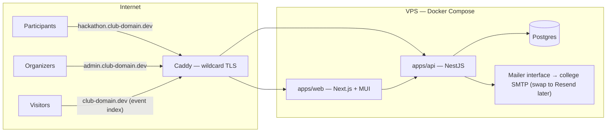
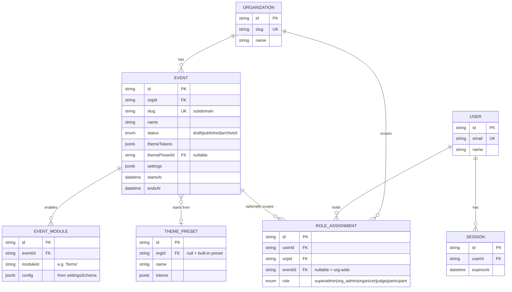

# event-utils — Architecture

> One platform. Every club event. One codebase.

**Repo:** https://github.com/recursekmit/event-utils
**Status:** v0.1 draft for CIG review · 2026-09-17 · Maintainer: Bharath

---

## 1. How to use this document

This document is written to be **self-contained**. Paste the whole thing into your AI assistant (Claude, ChatGPT, Copilot, whatever you use) and it will have enough context to help you write a module, review a spec, or answer questions about the system.

Two kinds of content live here:

| Kind | Where | What it means for you |
|------|-------|----------------------|
| **Fixed** | §11 ADR log, boundary rules in §5/§8 | These decisions are settled. Don't propose changing them in your module — propose an ADR amendment if you truly think one is wrong. |
| **Open** | Module ideas, hook event names, token list | These grow over time. Feature requests and module specs are exactly how. |

New to the project? Read §1–§5 in order, skim the ERD in §6, then read §9 (the module system) — that's the part you'll code against.

---

## 2. What event-utils is

Clubs run the same category of events every year — hackathons, recruitment drives, workshops, fests — and every time, someone builds a one-off website that gets thrown away. event-utils is a single, reusable, open-source platform that runs **all of a club's events**:

- One central deployment; each event gets its own **subdomain** (`hackathon.recurse.dev`).
- Each event gets its own **theme** (colors, fonts, logo, banner) via design tokens + preset gallery.
- Features are **modules** — mix-and-match building blocks (forms/registration, judging, exams, check-in…) enabled per event through a manifest + hook-bus plugin system.
- **Org-ready** from day one: the data model supports multiple organizations, though v1 provisions only Recurse (KMIT's technical club).
- **Open source (AGPL-3.0)**, built by the club's web-dev CIG with outside contributors welcome.

**Users:** club organizers (configure events, themes, modules), judges/staff (module UIs), participants (register, submit, view event pages).

---

## 3. Glossary

| Term | Meaning |
|------|---------|
| **Org** | An organization/club running events (v1: Recurse only, schema supports many) |
| **Event** | A time-bounded activity (hackathon, recruitment…) on its own subdomain |
| **Core** | The platform proper: auth, orgs/events, roles, theming, module registry, hook bus, minimal landing page |
| **Module** | A self-contained feature package living in `modules/*`, declared by a manifest |
| **Manifest** | A module's declaration: metadata, permissions, hooks, routes, settings schema |
| **Hook bus** | Event emitter modules use to react to each other and to core — the *only* cross-module integration path |
| **Token** | One named design value (e.g. `color.primary`) stored per event |
| **Preset** | A named, complete token set (e.g. "Hackathon Dark") organizers start from |
| **Theme Editor** | Admin UI: pick a preset, override tokens, live preview |
| **Participant** | An end user of an event site (registers, submits) |

---

## 4. System overview



One Next.js app serves everything, resolved by host:

| Host | Renders |
|------|---------|
| `<event-slug>.club-domain.dev` | That event's themed site: core landing + enabled modules' public routes |
| `admin.club-domain.dev` | Admin shell: event picker, theme editor, module toggles, roles/invites, exports, module admin panels |
| `club-domain.dev` (apex) | Platform landing + public event index |

In development, `*.localhost` behaves the same way.

---

## 5. Tech stack

| Layer | Choice | Rationale |
|-------|--------|-----------|
| Frontend | **Next.js** (App Router) + **MUI** | MUI's ThemeProvider consumes a theme object natively — the token system maps 1:1 |
| Styling | **CSS-in-JS via MUI theming** | Fully dynamic per-event themes with no rebuild step |
| Backend | **NestJS** | Structured, DI-based, familiar module pattern; friendly to contributors |
| Database | **Postgres + Prisma** | Relational core (registrations, scores, events); typed schema doubles as contributor docs; JSONB for form answers & config |
| Auth | **Email magic links** (self-built) | No passwords, no OAuth dependency; matches student reality |
| Email | **Mailer DI interface** → college SMTP now, Resend-ready | Swapping providers later is a config change, not a rewrite |
| Monorepo | **pnpm workspaces** (+ Turborepo when useful) | Juniors clone once; a module PR touches one folder |
| Proxy/TLS | **Caddy** | Automatic wildcard TLS via DNS-01 — solves the subdomain requirement |
| Deployment | **Docker Compose** on the club VPS | One command to redeploy; solves the "who maintains this after us" handover |

Versions are tracked in `package.json` files — this doc won't pin them.

---

## 6. Repository layout

```
event-utils/
├── apps/
│   ├── web/                 # Next.js — event sites + admin shell
│   └── api/                 # NestJS — core API + module registry + hook bus
├── packages/
│   ├── core/                # shared types: manifest spec, hook bus contracts, role guards
│   ├── theme/               # token definitions, presets, theme utilities
│   └── ui/                  # shared primitives if modules need them beyond MUI
├── modules/
│   ├── _template/           # copy-paste starting point for new modules
│   └── forms/               # reference module: forms + registration
├── docs/
│   └── ARCHITECTURE.md      # this file
├── .github/
│   ├── ISSUE_TEMPLATE/      # feature-request template (see §10)
│   └── workflows/           # lint, typecheck, test, manifest validation, affected builds
├── docker-compose.yml       # web, api, postgres, caddy (+ mailhog in dev)
└── pnpm-workspace.yaml
```

---

## 7. Core responsibilities (the boundary)

**Core owns exactly this, nothing more:**

1. **Auth** — magic-link issuance, sessions, guards
2. **Orgs & events** — CRUD, publish lifecycle, subdomain resolution, event settings
3. **Roles** — the 5-tier model (§8), assignment, permission guards
4. **Theming** — token storage, presets, theme resolution per host
5. **Module registry** — manifest loading at boot, per-event enable/disable, settings auto-UI
6. **Hook bus** — typed event emit/subscribe
7. **Minimal landing page** — themed hero, description, schedule, CTA, fed from event settings (so the Theme Editor always previews something real, and a fresh event with zero modules still shows a page)

**Everything else is a module** — including forms and registration. The first module (`forms`) is the *reference module*: its job is to prove the module API before v1 of that API is frozen.

**The boundary rules:**

- Modules never import each other or core internals. Integration happens **only** via the hook bus.
- Modules never touch tables they don't own.
- Core never special-cases a module (`if (module === 'forms')` is a design bug — report it).

---

## 8. Data model

### ERD



*(Magic-link tokens are short-lived and stored hashed; shown implicitly under auth.)*

### Isolation rules

- **Shared tables with FKs**: every row carries `org_id` (+ `event_id` where meaningful). API guards enforce scope on every request — no client-supplied IDs trusted.
- **Module data**: modules own their tables, **prefixed with the module id** (`forms_questions`, `forms_submissions`, `judging_scores`). Every module table **must** have `event_id` FK. Module Prisma models live in the module folder. CI validates prefixes and required FKs.
- Cross-event queries (e.g. "has this person registered before?") are allowed only in core, via `org_id` + `user_id`.

### Roles

| Role | Scope | Can do |
|------|-------|--------|
| `superadmin` | platform | everything, incl. org provisioning (v1: you) |
| `org_admin` | org | manage events, roles, themes, modules |
| `organizer` | event | configure their event, view participants, run modules' admin panels |
| `judge` | event | access judging module UIs only |
| `participant` | event | register, submit, view |

Modules may request permissions in their manifest (e.g. `participant:read`); core validates that the requesting role holds them. Modules may register additional roles later via manifest — judges were the proof case.

---

## 9. Module system

### 9.1 Manifest spec (draft)

```ts
// packages/core defines the contract
export interface ModuleManifest {
  id: string;                 // 'forms' — kebab-case, unique, also used as table prefix
  version: string;            // semver
  title: string;
  description: string;
  permissions: string[];      // e.g. ['event:read', 'participant:write']
  hooks: {
    emits: string[];          // 'forms.submitted'
    subscribes: string[];     // 'event.published'
  };
  publicRoutes?: RouteDecl[]; // mounted on the event site, inside the themed layout
  adminRoutes?: RouteDecl[];  // mounted in the admin shell
  settingsSchema: JsonSchema; // auto-generates the per-event module config UI
}
```

### 9.2 Reference module example

```ts
// modules/forms/src/manifest.ts
import { defineModule } from '@event-utils/core';

export default defineModule({
  id: 'forms',
  version: '0.1.0',
  title: 'Forms & Registration',
  description: 'Structured form builder and registration flow.',
  permissions: ['event:read', 'participant:write'],
  hooks: {
    emits: ['forms.submitted'],
    subscribes: ['event.published'],
  },
  publicRoutes: [
    { path: '/register', component: 'RegistrationPage' },
    { path: '/register/status', component: 'RegistrationStatusPage' },
  ],
  adminRoutes: [
    { path: 'forms', component: 'FormBuilderPage' },
    { path: 'forms/submissions', component: 'SubmissionsPage' },
  ],
  settingsSchema: {
    type: 'object',
    properties: {
      requireCollegeEmail: { type: 'boolean', default: true },
      confirmationMessage: { type: 'string', default: 'You are registered!' },
    },
  },
});
```

### 9.3 Hook bus

Typed, namespaced, the only cross-module channel:

| Source | Event | Fired when |
|--------|-------|-----------|
| core | `event.published` | organizer publishes |
| core | `theme.updated` | tokens saved |
| core | `participant.joined` | a user logs in / registers on an event for the first time |
| module | `<module>.<verb>` | e.g. `forms.submitted`, `judging.round_closed` |

```ts
// a notifications module reacting to the reference module
bus.on('forms.submitted', async ({ eventId, actor, payload }) => {
  await mailer.sendConfirmation(actor.email, eventId);
});
```

Rules: handlers must be idempotent; failures are logged, never crash the emitter; event names are registered in the manifest so the registry can draw a dependency graph.

### 9.4 Loading (v1)

Modules live in `modules/*`, register at boot, and are enabled **per event** through the admin shell (stored as `event_modules` rows). No runtime hot-loading, no marketplace — that's deferred until the API is proven. The registry interface is designed so a marketplace loader could replace it later without touching module code.

### 9.5 Module UI

Modules ship React components mounted at their declared routes inside the themed layout (MUI theme from the event's tokens flows into them automatically). In the admin shell, module admin panels mount the same way, and the `settingsSchema` renders as an auto-generated settings form.

---

## 10. Feature request → build process

For web-dev CIG contributors:

1. **Open a feature-request issue** using the template — describe the event workflow you're solving for, not just the feature.
2. Maintainers triage: accepted, needs-spec, or rejected (with reason).
3. Accepted ideas get a **spec** (short template: user stories, data owned, hooks emitted/needed, routes) — often written with the proposer.
4. Specs are trimmed to what the frozen module API supports, then built in **rounds**.
5. PRs need one maintainer approval (Bharath + senior co-maintainer), green CI, and manifest validation.

While the module API is pre-freeze (Phases 1–2), expect specs to shape the API itself — that's the point of the reference module.

---

## 11. ADR log

| # | Decision | Choice | One-line rationale |
|---|----------|--------|--------------------|
| 001 | Deployment model | One central instance, event picker | True code reuse; isolation handled in data layer |
| 002 | Event URLs | Subdomain per event | Clean branding; requires wildcard DNS + TLS (Caddy) |
| 003 | Tenancy | Org-ready schema, Recurse-only v1 | Other clubs adopt later without migration |
| 004 | Stack | Next.js + NestJS + Postgres/Prisma | Typed end-to-end; Prisma schema as contributor docs |
| 005 | Repo layout | pnpm monorepo | One clone; module PR = one folder |
| 006 | Core boundary | Lean core; forms/registration is a module | Plugin API proven before freeze |
| 007 | Module system | Manifest + hook bus, in-repo boot-time | Loose coupling (ADB-inspired); no marketplace yet |
| 008 | Module UI | Declared routes + React in themed layout | Flexibility with visual consistency |
| 009 | Data isolation | Shared tables + `org_id`/`event_id` FKs + guards | Simple, Prisma-native, queryable |
| 010 | Auth | Email magic links | No passwords, no OAuth vendor dependency |
| 011 | Email | Mailer DI interface; college SMTP first | Swap to Resend is config, not code |
| 012 | Roles | 5-tier (superadmin→org_admin→organizer→judge→participant) | Covers real workflows without a full RBAC engine |
| 013 | Theming | Design tokens + presets via CSS-in-JS (MUI) | Dynamic per-event theming, live-preview-friendly |
| 014 | Components | MUI | Native fit with the token model |
| 015 | Landing page | Minimal landing owned by core | Theme editor always previews something; fresh events aren't blank |
| 016 | Admin dashboard | Core shell + module-declared panels | Consistent organizer UX, extensible by modules |
| 017 | Hosting | Club VPS + Docker Compose | Control, wildcard TLS, one-command handover |
| 018 | License | AGPL-3.0 | Improvements stay open; fork-closed protection |
| 019 | Payments | Deferred as a future module | Most events free; core stays clean; hook bus makes it bolt-on |
| 020 | Module API freeze | After the reference module ships | Freeze what's proven, not what's imagined |
| 021 | Feature intake | Issues → spec template → build rounds | Structured funnel for CIG proposals |
| 022 | Reviews | Maintainer + senior CIG co-maintainer | No single bottleneck |
| 023 | Repo | Public day one, in the club org | Campaign visibility; contributors watch from commit one |
| 024 | Sequencing | Architecture doc → skeleton → reference module | Doc-first, per maintainer call |

---

## 12. Roadmap

| Phase | Deliverable | Notes |
|-------|-------------|-------|
| **0 — now** | Repo in club org, this doc, feature-request issues open | Happening in parallel |
| **1 — skeleton** | Monorepo, auth (magic links), org/event model, module registry stub, theme tokens rendering, Caddy + compose | The walking skeleton |
| **2 — reference module** | `forms` module: structured builder (typed question blocks → JSON schema), registration flow, submissions admin | Proves manifest, hooks, admin panels, module data rules |
| **3 — freeze** | Module API v1 frozen, `CREATE-MODULE.md` + `_template` finalized, CI gates on | After this, contributors ship independently |
| **4 — CIG rounds** | Accepted specs built in rounds | Judging, exams, check-in, whatever the funnel surfaces |

---

*This doc is the source of truth for architecture. It evolves by ADR amendment — propose via issue.*
